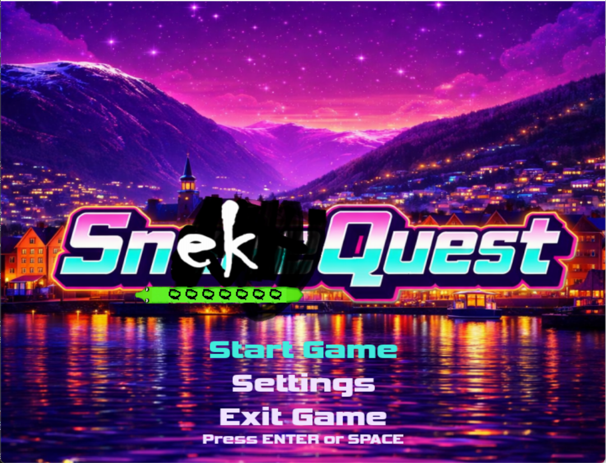
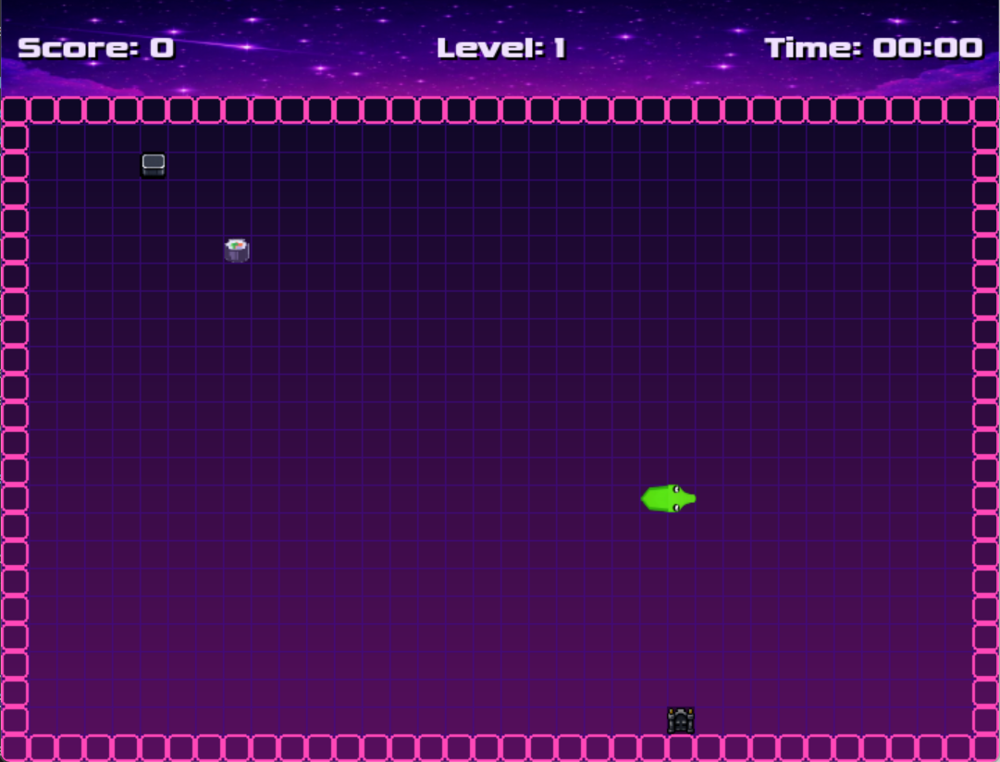
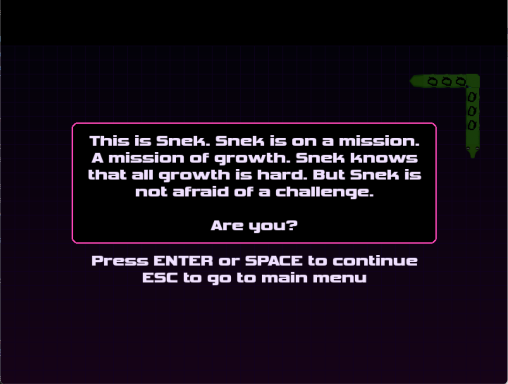

# SnekQuest

<div align="center">

<h1><strong>“This is SnekQuest; a game about growth, challenges and sacrifice. Like life, but more like snake. Enjoy”</strong></h1>

<strong>— IDMG</strong>

</div>

SnekQuest is an AI-assisted Snake clone built with pygame-ce. It adds a gates-and-keys mechanic, level transitions, and optional audio/visual assets.

## Screenshots

### Menu



### Gameplay



### Background artwork



## Credits and AI disclosure

SnekQuest is a clone of the classic Snake game, with additional gameplay features. IDMG made the music and snake sprite. Sound effects are from royalty-free services. AI assisted with the code and all other visual assets.

## Features
- Main menu with settings (speed + sound toggle) before starting a run.
- Persistent leaderboard (top 5 scores) with name entry.
- Gates & keys mechanic to advance levels after collecting enough food.
- Animated level-loading sequence plus a Level Clear pause between stages.
- HUD for score/level/time with custom font support.
- Optional art and sound assets from `assets/`, with graceful fallbacks when files are missing.

## Requirements
- Python 3.10+
- pygame-ce (drop-in replacement for pygame)

## Install
```bash
python -m pip install --upgrade pip
python -m pip install pygame-ce
```

## Run
```bash
python main.py
```

## Controls
- **Main Menu**: `Up/Down` (or `W/S`) to select, `Enter`/`Space` to confirm.
- **Settings**: `Up/Down` to select, `Left/Right` to adjust, `1/2/3` set speed, `Enter` to open leaderboard, `Esc` to return.
- **In-game**: Arrow keys or `W/A/S/D` to move, `Enter` to pause/resume, `Esc` to quit.
- **Sacrifice levels**: Eat food to gain one shot of ammo, then press `F` to fire at the breakable wall. Firing consumes ammo and one snake segment. Move with arrows or `W/A/S/D`.
- **Escape/final boss**: Eat food to gain ammo, then press `F` to shoot. Aim by moving the snake; shots follow its current direction.
- **Paused**: `Enter` to resume, `Esc` returns to main menu.
- **Level Clear**: `Space` to continue, `Esc` exits.
- **Game Over**: `Left/Right` (or `A/D`) changes speed; `1/2/3` selects Slow/Normal/Fast. Press `Space` to retry the current level at the selected speed without losing earlier level progress. Type a name (letters/numbers, max 10 characters) and press `Enter` to save the score; `Esc` returns to the menu.
- **Debug shortcuts**: `N` skips the current level; `Q` jumps to the final boss.

## Leaderboard
- Stored in `leaderboard.json` (auto-created on the first game over).
- If you skip name entry, the game saves `Snake####` automatically.

## Assets

Optional runtime artwork, fonts, and sounds live in `assets/`. The game falls back to shapes, system fonts, or silence when an asset is absent. Menu/game backgrounds and sprites, IDMG's music and snake sprite, and royalty-free sound effects are bundled there.

## Project layout
- `main.py` entry point; `game.py`, `snake.py`, `food.py`, `grid.py`, and `config.py` contain the game logic.
- `assets/` optional runtime art, fonts, and audio. Missing assets use built-in fallbacks.
- `docs/screenshots/` README screenshots; `docs/FINISHING_PLAN.md` development checklist.
- `tests/` lightweight display-free logic tests.
- `SnekQuest.spec` PyInstaller recipe for building the Windows release folder.

## Build a Windows release

Install Python 3.10+ and pygame-ce, then install PyInstaller and build from the repository root:

```bash
python -m pip install pygame-ce pyinstaller
pyinstaller --noconfirm SnekQuest.spec
```

The playable folder is created at `dist/SnekQuest/`. Zip the entire folder for itch.io; keep generated `build/` and `dist/` output out of GitHub.

## Finish Checklist
- Play through every level group at each speed setting: normal gates, Tetris arenas, sacrifice arenas, escape, and final boss.
- Tune required food, arena spacing, ammo, and boss health from observed playthrough time instead of guessing in code.
- Replace placeholder/fallback visuals only where they improve readability. Missing assets must remain non-fatal.
- The desktop pygame version is the source of truth.

## License

SnekQuest is released under the MIT License. You are free to use, copy, modify, merge, publish, distribute, sublicense, and sell copies of the game, its code, and its assets, provided the copyright and license notice are included. The software is provided without warranty. See [LICENSE](LICENSE) for the full terms.

— IDMG
